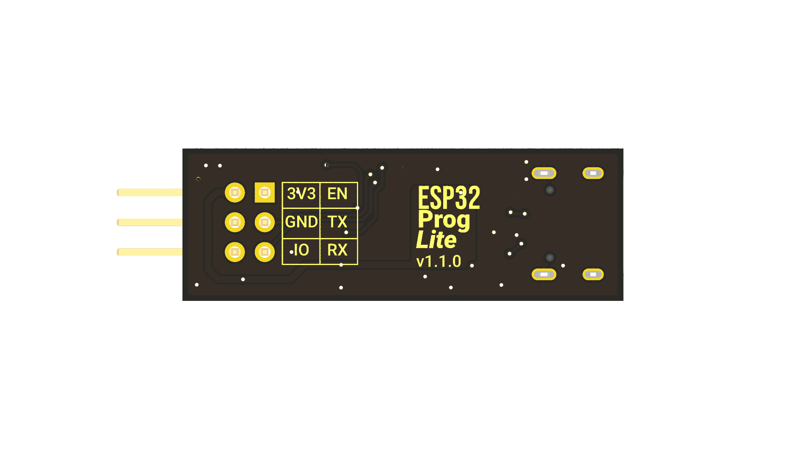
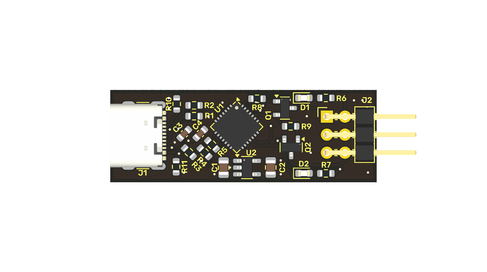
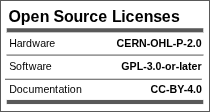

 </br>
[certification OSHW](https://certification.oshwa.org/pe000001.html)

---
# ESP32 Prog Lite

This module was designed to optimize the programming of ESP32 devices in production environments. It emerged as a solution to a common problem: the need to efficiently and cost-effectively program electronic products that don't require a USB port for final operation.

|             |                 |
|:------------:|:----------------:|
|          ||


## The USB problem in production

For devices that run on alkaline batteries or are programmed only once at the factory, a USB connector and its integrated serial converter, such as the popular CP2102N, represent an unnecessary cost. In mass production, these components add up to a considerable expense. For example, in a production run of 1,000 units, a converter at $2 USD per piece increases the total cost by $2,000 USD, not including the other associated components and the space they take up on the board.

In a real-world case, a customer looking to update their PCB design had a USB-C converter on their board. By eliminating these circuits and offering our solution, which uses Pogo-Pin clips, we were able to significantly reduce their costs and production time.

## A simple and efficient design

Our main objective was to simplify the programming process, making it as small and efficient as possible. We were inspired by the **ESP-programmer**, a device known for its JTAG programming and debugging capabilities. However, our goal was not to replicate all of its features, but rather to create a minimalist tool focused exclusively on production programming that would allow for seamless integration and rapid adoption on any assembly line.

This approach has allowed us to develop a programmer that offers a low-cost, high-performance solution for mass production of ESP32-based products.

## Why choose this programmer?

* **Cost savings:** Eliminates the need for integrated USB-to-serial converters on each board, dramatically reducing unit costs in mass production.

* **Space optimization:** Its compact design frees up valuable PCB space, ideal for products with size constraints.

* **Production efficiency:** Enables quick and easy programming using Pogo-Pin connectors, streamlining the manufacturing process.

## BOM
| **#**     | **Reference**     | **Description**                                                                                                           | **Qty**   | **Part #**                | **Manufacturer**              | **LCSC**  |
|-------    |---------------    |------------------------------------------------------------------------------------------------------------------------   |---------  |-----------------------    |---------------------------    |---------- |
| 1         | C3                | 10V 4.7uF X5R ±10% 0603 Multilayer Ceramic Capacitors MLCC - SMD/SMT ROHS                                                 | 1         | CL10A475KP8NNNC           | Samsung Electro-Mechanics     | C1705     |
| 2         | C4                | 50V 100nF X7R ±10% 0603 Multilayer Ceramic Capacitors MLCC - SMD/SMT ROHSr                                                | 1         | CC0603KRX7R9BB104         | YAGEO                         | C14663    |
| 3         | C1,C2             | 50V 1uF X7R ±10% 0805 Multilayer Ceramic Capacitors MLCC - SMD/SMT ROHS                                                   | 2         | CL21B105KBFNNNE           | Samsung Electro-Mechanics     | C28323    |
| 4         | J2                | Right Angle Pin Header 2.5mm 6mm 6P -40℃~+105℃ 2.54mm 2 Black Brass 2x3P Push-Pull,P=2.54mm Pin Headers ROHS              | 1         | PH2.54-07-03PWS           | XUNPU                         | C7501617  |
| 5         | J1                | USB 2.0-only 14P Type-C Receptacle connector                                                                              | 1         | TYPE-C 16PIN 2MD(073)     | SHOU HAN                      | C2765186  |
| 6         | D1,D2             | 25mA 80mcd~220mcd Independent Diode 615nm~630nm -30℃~+85℃ Red 130° 65mW 1.6V~2.6V 0603 LED Indication - Discrete ROHS     | 2         | NCD0603R1                 | NATIONSTAR                    | C84263    |
| 7         | U1                | USB to UART QFN-28-EP(5x5) USB Converters ROHS                                                                            | 1         | CP2102N-A02-GQFN28R       | SILICON LABS                  | C964632   |
| 8         | U2                | 600mA low dropout linear regulator, with enable pin, 3.8V-6V input voltage range, 3.3V fixed positive output, SOT-23-5    | 1         | AP2112K-3.3TRG1           | Diodes Incorporated           | C51118    |
| 9         | Q1,Q2             | 40V 200mW 100@10mA,1V 200mA NPN SOT-23 Bipolar (BJT) ROHS                                                                 | 2         | MMBT3904                  | TWGMC                         | C727127   |
| 10        | R1,R2             | 100mW Thick Film Resistors 75V ±1% ±400ppm/℃ 10Ω 0603 Chip Resistor - Surface Mount ROHS                                  | 2         | 0603WAF100JT5E            | UNI-ROYAL                     | C22859    |
| 11        | R3                | 100mW Thick Film Resistor 75V ±100ppm/℃ ±1% 22.1kΩ 0603 Chip Resistor - Surface Mount ROHS                                | 1         | RC0603FR-0722K1L          | YAGEO                         | C137768   |
| 12        | R4                | 100mW Thick Film Resistor 75V ±100ppm/℃ ±1% 47.5kΩ 0603 Chip Resistor - Surface Mount ROHS                                | 1         | RC0603FR-0747K5L          | YAGEO                         | C137715   |
| 13        | R5                | Thin Film Resistors - SMD 1K ohm 1% 1/10W                                                                                 | 1         | ARG03FTC1001              | Viking                        | C217840   |
| 14        | R6,R7             | Thick Film Resistors - SMD 330 Ohms 100mW 0603 1%                                                                         | 2         | RC0603FR-07330RL          | YAGEO                         | C105881   |
| 15        | R8,R9             | 100mW ±100ppm/℃ ±1% 10kΩ 0603 Chip Resistor - Surface Mount ROHS                                                          | 2         | RMC16K103FTP              | KAMAYA                        | C323556   |
| 16        | R10,R11           | 100mW Thick Film Resistor 75V ±100ppm/℃ ±1% 5.1kΩ 0603 Chip Resistor - Surface Mount ROHS                                 | 2         | 0603WAF5101T5E            | UNI-ROYAL                     | C23186    |

## Generate panel

To do this it is required [Kikit](https://github.com/yaqwsx/KiKit?tab=readme-ov-file)

```sh
kikit panelize \
    --layout 'grid; rows: 6; cols: 2; space: 2mm' \
    --tabs 'fixed; width: 3mm; vcount: 2' \
    --cuts 'mousebites; drill: 0.5mm; spacing: 1mm; offset: 0.2mm; prolong: 0.5mm' \
    --framing 'railstb; width: 5mm; space: 3mm;' \
    --tooling '3hole; hoffset: 2.5mm; voffset: 2.5mm; size: 1.5mm' \
    --fiducials '3fid; hoffset: 5mm; voffset: 2.5mm; coppersize: 2mm; opening: 1mm;' \
    --text 'simple; text: MaykolRey.com; anchor: mt; voffset: 2.5mm; hjustify: center; vjustify: center;' \
    --text2 'simple; text: Created on {date}; anchor: mb; voffset: -2.5mm; hjustify: center; vjustify: center;' \
    --post 'millradius: 1mm' \
    ESP_32_Programer.kicad_pcb panel/panel.kicad_pcb
```
## Licence



Author: Maykol Rey
